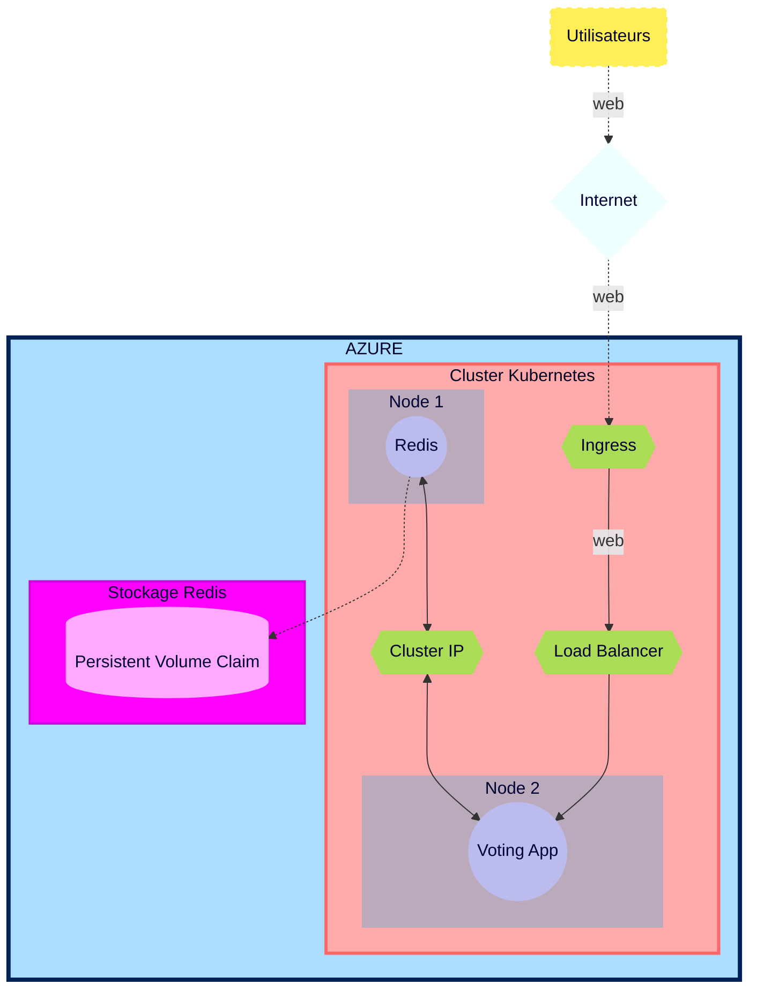

## Plan d'action Brief 6 - Part 1  

<div id='top'/>  

## Sommaire
### [0 - Scrum quotidien](#Scrum)
### [1 - Lecture des documentations Kubernetes et AKS](#Documentations)
### [2 - Topologie de l'infrastructure](#Topologie)
### [3 - Liste ressources](#Ressources)
### [4 - Déploiement d'un cluster AKS avec deux nodes](#ClusterAKS)
### [5 - Déploiement de Redis et de la Voting App](#RedisVotApp)
### [7 - Déploiement d’un Load Balancer](#LB)
### [8 - Application d'un ClusterIP pour Redis](#ClusterIP)
### [9 - Configuration d'un mot de passe pour le container Redis](#MDP)
### [10 - Création d'un secret Kubenetes](#Secret)
### [11 - Création d'un compte de stockage](#Stockage)
### [12 - Configuration d'un Persistent Volume et d'un P.V. Claim](#PVC)
### [13 - Création d'Ingress controller avec Kubernetes/nginx](#Ingress)
### [14 - Création d'un enregistrement DNS sur Gandi](#Gandi)
### [15 - Création d'un certificat TLS avec cert-manager pour la Voting App](#certificat)
### [16 - Auto-scaling horizontal de la Voting App](#Auto-scaling)
### [17 - Test de la montée en charge](#Charge)
### [18 - Executive summary + fonctionnement de Kubernetes](#Summary)
### [19 - Document d'Architecture Technique de l'infrastructure déployée](#DAT)

[&#8679;](#top)   

<div id='Scrum'/>   

00. **Scrum quotidien**
Scrum Master = Moi (brief individuel)
Compte-rendu quotidien immédiat et désignation des premières tâches du jour.

Réunions hebdomadaires avec les autres membres de la formations afin de déterminer les difficultés, facilités et avancées de chacun.  

[scrums](https://github.com/simplon-lerouxDunvael/Brief_6/blob/main/Docs/M%C3%A9thodologie_Scrum.md)

[&#8679;](#top)  

<div id='Documentations'/>  

### **Lecture des documentations Kubernetes et AKS**
Lecture des documentations afin de déterminer les fonctionnements, prérequis et outils/logiciels nécessaires pour remplir les différentes tâches du Brief 6.

[&#8679;](#top)  

<div id='Topologie'/>  

### **Topologie de l'infrastructure**
Infrastructure Plannifiée

*Schéma réalisé dans le cas plus général où les pods ne sont pas dans le même node.*
*Les pods sont schématisés par un seul objet même s'ils peuvent représenter plusieurs réplicas.*



[&#8679;](#top)  

<div id='Ressources'/>  

### **Liste ressources**

-----------
| Ressources | Cluster AKS | Redis |  Voting App |
| :--------: | :--------: | :--------: | :--------: |
| Azure service | ✓ | ✓ | ✓ |
| ressource groupe | ✓ |✓ | ✓ |
| SSH (port) | N/A | 6379 | 80 |
| CPU | N/A | 100m-250m | 100m-250m |
| Mémoire | N/A | 128mi-256mi | 128mi-256mi |
| Image | N/A | redis:latest  | whujin11e/public:azure_voting_app |
| Load Balancer | N/A | ✓ puis ✗ | ✓ |
| ClusterIP | N/A | ✗ puis ✓ | ✗ |
| Kebernetes secret | ✓ | ✓ | ✓ |
| Storage secret | ✓ | ✓ | ✓ |
| Storage account (Standard LRS) | N/A | ✓ | ✓ |
| Persistent Volume | N/A | ✓ | ✗ |
| Persistent Vol. Claim (3Gi)| N/A | ✓ | ✗ |
| Ingress | ✓ | ✗ | ✓ |
| Nginx| ✓ | ✗ | ✗ |
| Certificat TLS | N/A | ✗ | ✓ |
| Auto-scaling | ✗ | ✗ | ✓ (deployment) |

ID Subscription : 
a1f74e2d-ec58-4f9a-a112-088e3469febb

[&#8679;](#top)  

<div id='ClusterAKS'/>   

### **Déploiement d'un cluster AKS avec deux nodes**

[***Doc***](https://learn.microsoft.com/en-us/azure/aks/tutorial-kubernetes-deploy-cluster?tabs=azure-cli)

```bash
az aks create -g b6duna -n AKSClusterd --enable-managed-identity --node-count 2 --enable-addons monitoring --enable-msi-auth-for-monitoring  --generate-ssh-keys
```
##### Connexion au Cluster

```bash
az aks get-credentials --resource-group b6duna --name AKSClusterd
```

[&#8679;](#top)  

<div id='RedisVotApp'/>  

### **Déploiement de Redis et de la Voting App**

[***Doc***](https://learn.microsoft.com/en-us/azure/aks/learn/quick-kubernetes-deploy-cli#code-try-7)

A l'aide de la documentation ci-dessus, j'ai déployé les images de Redis et de la Voting App ainsi que leurs services respectifs à partir d'un même fichier .yaml.

[Redis et la VotingApp avec leurs services respectifs](https://github.com/simplon-lerouxDunvael/Brief_6/blob/main/Part_1/azure-vote-part1-final.yaml)

```bash
azure-vote-part1-final.yaml
```

[&#8679;](#top)  

<div id='LB'/>  

### **Déploiement d’un Load Balancer**

Afin de vérifier que l'application pouvait se connecter à redis, j'ai utilisé le type de service en mode Load Balancer.

[&#8679;](#top)  

<div id='ClusterIP'/>  
   
### **Application d'un ClusterIP pour Redis**

Puis, j'ai changé le type de service en mode ClusterIP afin de protéger Redis de connexions externes, tout en autorisant la connexion avec le service de la Voting App.

##### Déterminer le type de service réseau

```bash
kubectl get service voting-service --watch
```

[&#8679;](#top)  

<div id='MDP'/>  

### **Configuration d'un mot de passe pour le container Redis**

J'ai configuré le mot de passe de Redis en utilisant les secrets Kubernetes et la variable d'environnement qui y est associée. Les arguments ont également été configurés selon les conditions demandées et la variable "allow empty password" a été désactivée.

```yaml
args: ["--requirepass", "$(REDIS_PWD)"]
env:
        - name: ALLOW_EMPTY_PASSWORD
          value: "no"
        - name: REDIS_PWD
          valueFrom:
            secretKeyRef:
              name: redis-secret-duna
              key: password
```

[&#8679;](#top)  

<div id='Secret'/>  

### **Création d'un secret Kubenetes**

Afin de créer plusieurs clés dans un même secret, j'ai utilisé la commande suivante :

```bash
kubectl create secret generic [NAME_OF_SECRET] --from-literal=[KEY1]=[SECRET1] --from-literal=[KEY2]=[SECRET2]
```

```bash
kubectl create secret generic redis-secret-duna --from-literal=username=[USERNAME] --from-literal=password=[PASSWORD]
```

[&#8679;](#top)  

<div id='Stockage'/>  

### **Création d'un compte de stockage**

Pour créer un compte de stockage and le partage de fichiers (fileshare) j'ai utilisé le [Portail Azure](https://portal.azure.com/#home).

[&#8679;](#top)  

<div id='PVC'/>  

### **Configuration d'un Persistent Volume et d'un P.V. Claim**

[Multiple Nodes](https://stackoverflow.com/questions/54845025/does-kubernetes-support-persistent-volumes-shared-between-multiple-nodes-in-a-cl)

[AKS Multiple Nodes](https://learn.microsoft.com/fr-fr/azure/aks/azure-files-volume)

[AKS Storage](https://learn.microsoft.com/en-us/azure/aks/concepts-storage)

[AKS Storage Driver](https://learn.microsoft.com/en-us/azure/aks/csi-storage-drivers)

[AKS Azure file claim](https://learn.microsoft.com/en-us/azure/aks/azure-files-volume#mount-file-share-as-an-persistent-volume)

[Create PV](https://learn.microsoft.com/en-us/azure/aks/azure-files-volume)

Once the Fileshare created and associated to Storage Account, we create the PV and assign it with a PVC. As it's dedicated to Redis, we added it at the end of the .yaml file.

To do so though, we need to give access to the Storage Account with a K8s secret using this command:

```bash
kubectl create secret generic azure-secret --from-literal=azurestorageaccountname=b6lstorageacc --from-literal=azurestorageaccountkey=JBsbcnoq7ufOg+DJ45B6KN4YNow8GkHhjQHaJfyzn5DyVW9eU0mDfWTpUqMCEKDPWc0HZRyesp5s+AStmP212A==
```

[Red-Vote.yaml](https://github.com/Simplon-Luna/b6_Luna/blob/main/Part2/Red-Vote.yaml)

[&#8679;](#top)  

<div id='Ingress'/> 

## ***Part 2***

### **Création d'Ingress controller avec Kubernetes/nginx**

```bash
az aks create -g b6luna -n KlusterLuna --enable-managed-identity --node-count 4 --enable-addons monitoring --enable-msi-auth-for-monitoring  --generate-ssh-keys
```

And relink it.

```bash
az aks get-credentials --resource-group b6luna --name KlusterLuna
```

### **Creation of Ingress Controller with Kubernetes Nginx**

I got quite some issues with the ingress as it seemed to have conflicts with previous config files that weren't deleted properly. So I had to use multiple configuration files for my ingress. The main one being:

[ingress.yaml](https://github.com/Simplon-Luna/b6_Luna/blob/main/Part2/ingress.yaml)

Note that unlike what the doc state, you do not require an ACR on Azure to set it up.
    
[&#8679;](#top)

<div id='Gandi'/> 

### **Création d'un enregistrement DNS sur Gandi**

Once the ingress connected, we linked it on Gandi to access it with DNS.

[&#8679;](#top)

<div id='Certificat'/> 

### **Création d'un certificat TLS avec cert-manager pour la Voting App**

Once that done, we use Jetstack Gandi Cert-Manager Webhook

[jetstack](https://github.com/bwolf/cert-manager-webhook-gandi)

```bash
helm repo add jetstack https://charts.jetstack.io
```

Careful on the tutorial there, the version number isn't the latest. Be sure to check it prior to apply. At this day, 1.9.1 is the latest, not 1.5.4.

```bash
helm install cert-manager jetstack/cert-manager --namespace cert-manager --create-namespace --set installCRDs=true --version v1.9.1 --set 'extraArgs={--dns01-recursive-nameservers=8.8.8.8:53\,1.1.1.1:53}'
```

##### Set Gandi-credentials in a K8s secret

For that to be recognized and working, we need to create a K8s secret with the API token as a secret.

```bash
kubectl create secret generic gandi-credentials --namespace cert-manager --from-literal=api-token='[API TOKEN]'
```

##### Install Cert-manager webhook for Gandi

```bash
helm install cert-manager-webhook-gandi --repo https://bwolf.github.io/cert-manager-webhook-gandi --version v0.2.0 --namespace cert-manager --set features.apiPriorityAndFairness=true  --set logLevel=6 --generate-name
```

##### create secret role and bind for webhook

For the cert-manager webhook to access it properly, we need a role and to bind that role to the cert-manager.

```bash
kubectl create role access-secret --verb=get,list,watch,update,create --resource=secrets
```

kubectl create role [role-name] --verb=[Authorised-actions] --resource=[Authorised-resource]

```bash
kubectl create rolebinding --role=access-secret default-to-secrets --serviceaccount=cert-manager:cert-manager-webhook-gandi-1665664967
```


Then apply .yaml as instructed:

[ingress.yaml](https://github.com/Simplon-Luna/b6_Luna/blob/main/Part2/ingress.yaml) -> [letsencrypt-issuer.yaml](https://github.com/Simplon-Luna/b6_Luna/blob/main/Part2/letsencrypt-issuer.yaml) -> [certificate.yaml](https://github.com/Simplon-Luna/b6_Luna/blob/main/Part2/certif-space.yaml)


[&#8679;](#top)

<div id='Auto-scaling'/> 

### **Auto-scaling horizontal de la Voting App**

For the Horizontal Auto-scaling of Voting App, I used these turotials:

[Autoscaling](https://kubernetes.io/docs/tasks/run-application/horizontal-pod-autoscale/)

[Autoscaling Walkthrough](https://kubernetes.io/docs/tasks/run-application/horizontal-pod-autoscale-walkthrough/)

After thoroughly reading them, I created the following .yaml and applied to the already functionning cluster.

[Autoscaling-vote.yaml](https://github.com/Simplon-Luna/b6_Luna/blob/main/Part2/Autoscaling-vote.yaml)

[&#8679;](#top)

<div id='Charge'/> 

### **Test de la montée en charge**

As instructed, I re-used the load-testing script we used in the previous brief, using the live-checking and live-graphing script to heavily stress the servers, of course, after setting it properly to the new address and install.

[graph_loadtest.py](https://github.com/Simplon-Luna/b6_Luna/blob/main/graph_loadtest.py)


[&#8679;](#top)

<div id='Summary'/>  

### **Executive summary + fonctionnement de Kubernetes**

Cf. document "Executive Summary et fonctionnement de Kubernetes".

[&#8679;](#top)

<div id='DAT'/> 

### **Document d'Architecture Technique de l'infrastructure déployée**

Cf. document "DAT".

[&#8679;](#top)
