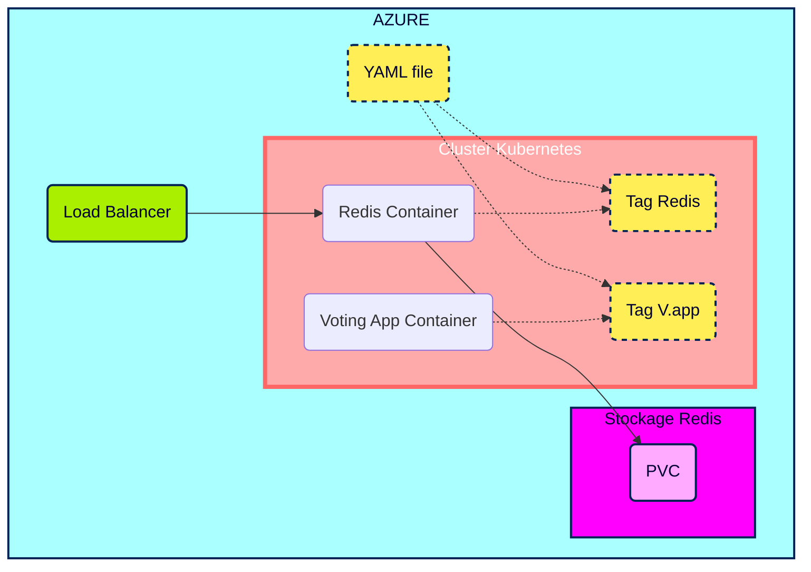

Infrastructure Plannifiée

```mermaid
flowchart TD 

yml(YAML file)
appGW(Load Balancer)

    subgraph AZ [AZURE]
        subgraph BDD [Stockage Redis]
            Stock(PVC)
        end
    
    subgraph Cluster [Cluster Kubernetes]
        KT-temp1(Voting App Container)
        KT-temp2(Redis Container)
        tag1(Tag V.app)
        tag2(Tag Redis)
        end


appGW --> KT-temp2
KT-temp2 --> Stock
KT-temp2 -.-> tag2
KT-temp1 -.-> tag1
yml -.-> tag2
yml -.-> tag1

    end

    classDef rouge fill:#faa,stroke:#f66,stroke-width:4px,color:#fff;
    class Cluster, rouge;
    classDef bleu fill:#aff,stroke:#025,stroke-width:2px,color:#003;
    class AZ, bleu;
    classDef rose fill:#f0f,stroke:#025,stroke-width:2px,color:#003;
    class BDD, rose;
    classDef vert fill:#ae0,stroke:#025,stroke-width:2px,color:#003;
    class appGW, vert;
    classDef blanc fill:#faf,stroke:#025,stroke-width:2px,color:#003;
    class Stock, blanc;
    classDef jaune fill:#fe5,stroke:#025,stroke-width:2px,color:#003,stroke-dasharray: 5 5;
    class yml,tag1,tag2, jaune;

```