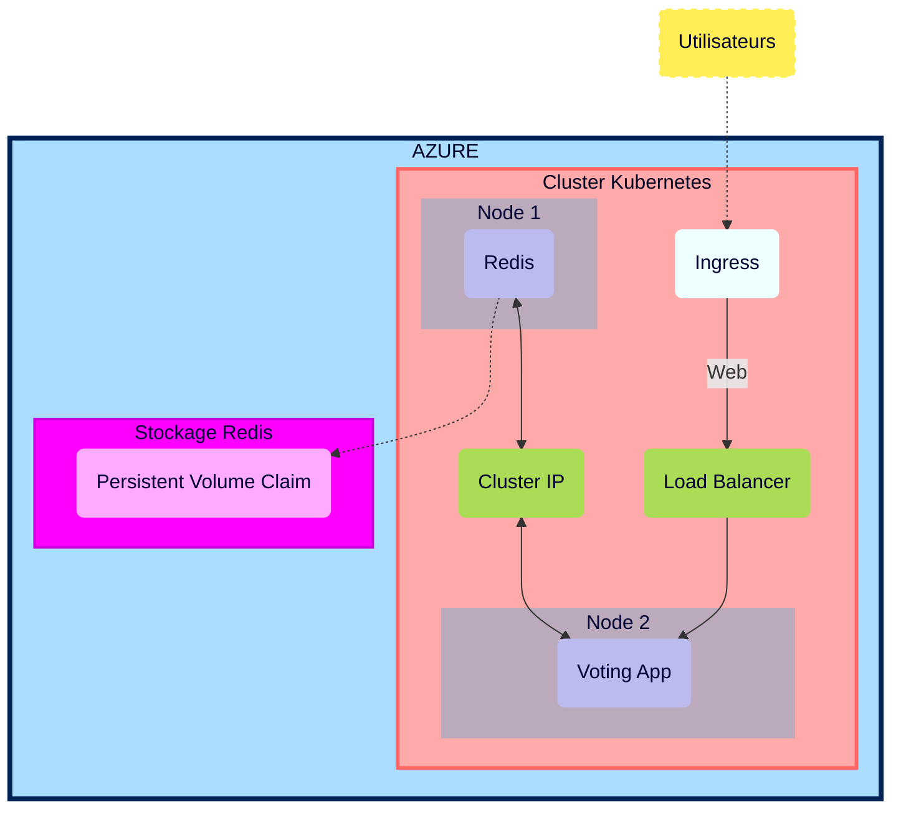

Infrastructure Plannifiée

```mermaid
flowchart TD

user(Utilisateurs)

    subgraph AZ [AZURE]
        
        subgraph Cluster [Cluster Kubernetes]
            appGW(Load Balancer)
            cluster(Cluster IP)
            Nginx(Ingress)

            subgraph n1 [Node 1]
                KT-temp1(Redis)
            end

            subgraph n2 [Node 2]
                KT-temp2(Voting App)
            end
        end

        subgraph BDD [Stockage Redis]
            Stock(Persistent Volume Claim)
        end

    end

appGW --> KT-temp2
KT-temp1 -.-> Stock
user -.-> Nginx --> |Web| appGW
KT-temp1 <--> cluster <--> KT-temp2

    classDef rouge fill:#faa,stroke:#f66,stroke-width:3px,color:#002;
    class Cluster, rouge;
    classDef bleu fill:#adf,stroke:#025,stroke-width:4px,color:#002;
    class AZ, bleu;
    classDef fuschia fill:#f0f,stroke:#c0d,stroke-width:2px,color:#003;
    class BDD, fuschia;
    classDef vert fill:#ad5,stroke:#ad5,stroke-width:2px,color:#003;
    class appGW,cluster, vert;
    classDef rose fill:#faf,stroke:#faf,stroke-width:2px,color:#003;
    class Stock, rose;
    classDef jaune fill:#fe5,stroke:#fe5,stroke-width:2px,color:#003,stroke-dasharray: 5 5;
    class user, jaune;
    classDef blanc fill:#eff,stroke:#eff,stroke-width:2px,color:#003;
    class Nginx, blanc;
    classDef gris fill:#bab,stroke:#bab,stroke-width:2px,color:#003;
    class n1,n2, gris;
    classDef bleugris fill:#bbe,stroke:#bbe,stroke-width:2px,color:#003;
    class KT-temp1,KT-temp2, bleugris;

```