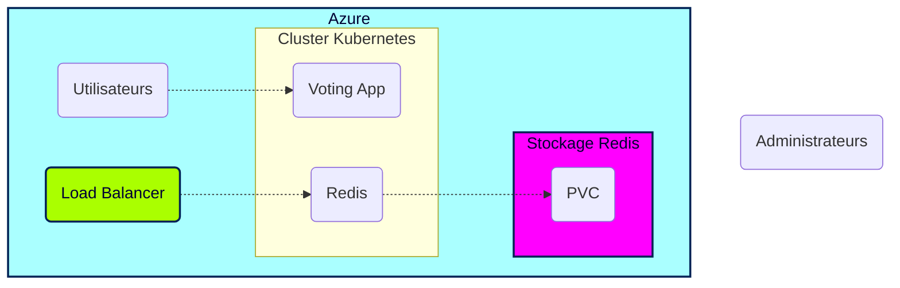

Infrastructure Plannifiée

```mermaid
flowchart TD 

user(Utilisateurs)
admin(Administrateurs)

    subgraph AZ [Azure]
        subgraph BDD [Stockage Redis]
            Stock(PVC)
        end
    
    subgraph Cluster [Cluster Kubernetes]
        KT-temp1(Voting App)
        KT-temp2(Redis)
        end

    appGW(Load Balancer)

appGW -.-> KT-temp2
KT-temp2 -.-> Stock
user -.->  KT-temp1

    end

    classDef rouge fill:#faa,stroke:#f66,stroke-width:4px,color:#fff,stroke-dasharray: 5 5;
    class VM, rouge;
    classDef sec fill:#aff,stroke:#025,stroke-width:2px,color:#003;
    class AZ, sec;
    classDef ter fill:#f0f,stroke:#025,stroke-width:2px,color:#003;
    class BDD,vmadmin, ter;
    classDef vert fill:#af0,stroke:#025,stroke-width:2px,color:#003;
    class proxy,appGW,Serv, vert;
    classDef blanc fill:#fff,stroke:#025,stroke-width:2px,color:#003;
    class Web, blanc;

```